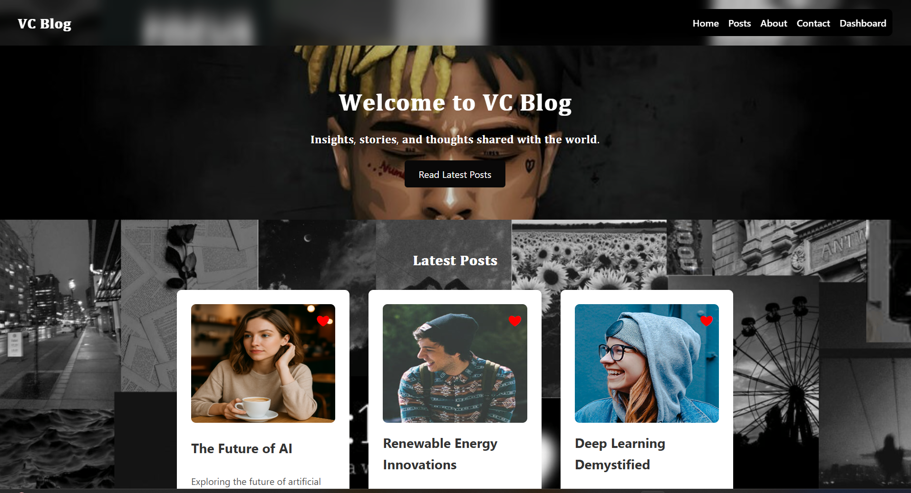
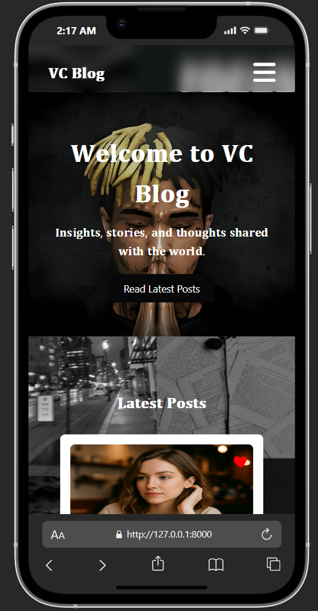

⚡ 𝐕𝐂 𝐁𝐥𝐨𝐠 𝐖𝐞𝐛𝐬𝐢𝐭𝐞
---
Welcome to the VC Blog Website, a simple and elegant blogging platform focused on venture capital topics, built with Python, Django, HTML, and CSS and Js.

🚀 𝐖𝐡𝐚𝐭 𝐢𝐬 𝐭𝐡𝐢𝐬?
---
A full-stack web app where users can:

•   🔍 Browse insightful VC-related blog posts

•   ✏️ Create, edit, and delete posts (if logged in)

•   📱 Enjoy a clean and responsive design

🎯 𝐔𝐬𝐚𝐠𝐞 𝐇𝐢𝐠𝐡𝐥𝐢𝐠𝐡𝐭𝐬
---

•    User registration and authentication (login/logout)

•    Full CRUD for blog posts (Create, Read, Update, Delete)

•    User Follow and unfollow

•    Like and unlike posts and comments dynamically

•    Comment on posts with text input

•    Real-time dashboard notifications alerting users about:

•    New comments on their posts

•    Likes on their posts/comments

•    Other personalized updates

•    Interactive UI with JavaScript for live updates and validation

•    Responsive design optimized for all devices

🛠 𝐁𝐮𝐢𝐥𝐭 𝐖𝐢𝐭𝐡
---
•    Python  – backend programming

•    Django – powerful web framework

•    HTML & CSS & Js – frontend structure and styling

•    Database - MySql

🔗 Live Demo
---
[Live Demo]()

🔴 REC 𝐃𝐞𝐦𝐨 Video
---

[▶️ Watch the video](templates/image/Blog-web.mp4)

📸 𝐃𝐞𝐦𝐨 𝐒𝐜𝐫𝐞𝐞𝐧𝐬𝐡𝐨𝐭
---
Laptop View
---

Moblie View
---

⚙️ 𝐇𝐨𝐰 𝐭𝐨 𝐑𝐮𝐧 𝐋𝐨𝐜𝐚𝐥𝐥𝐲
---

•    Clone the repo:

        git clone https://github.com/vignesh2git/vc-blog-website.git
        cd vc-blog-website

•    Set up virtual environment:

        python -m venv env
        source env/bin/activate   # Windows: env\Scripts\activate

•    Install dependencies:

        pip install -r requirements.txt

•    Run migrations:

        python manage.py migrate

•    Start the server:

        python manage.py runserver

•    Visit: http://127.0.0.1:8000

•    Create admin user (optional):

        python manage.py createsuperuser

🙌 𝐂𝐨𝐧𝐭𝐫𝐢𝐛𝐮𝐭𝐢𝐧𝐠
---

• Feel free to fork and send pull requests! For big changes, open an issue first.

📄 𝐋𝐢𝐜𝐞𝐧𝐬𝐞
---

MIT License
---

Copyright (c) 2025 Vignesh P

Permission is hereby granted, free of charge, to any person obtaining a copy
of this software and associated documentation files (the "Software"), to deal
in the Software without restriction, including without limitation the rights
to use, copy, modify, merge, publish, distribute, sublicense, and/or sell
copies of the Software, and to permit persons to whom the Software is
furnished to do so, subject to the following conditions:

The above copyright notice and this permission notice shall be included in
all copies or substantial portions of the Software.

THE SOFTWARE IS PROVIDED "AS IS", WITHOUT WARRANTY OF ANY KIND, EXPRESS OR
IMPLIED, INCLUDING BUT NOT LIMITED TO THE WARRANTIES OF MERCHANTABILITY,
FITNESS FOR A PARTICULAR PURPOSE AND NONINFRINGEMENT. IN NO EVENT SHALL THE
AUTHORS OR COPYRIGHT HOLDERS BE LIABLE FOR ANY CLAIM, DAMAGES OR OTHER
LIABILITY, WHETHER IN AN ACTION OF CONTRACT, TORT OR OTHERWISE, ARISING FROM,
OUT OF OR IN CONNECTION WITH THE SOFTWARE OR THE USE OR OTHER DEALINGS IN
THE SOFTWARE.
